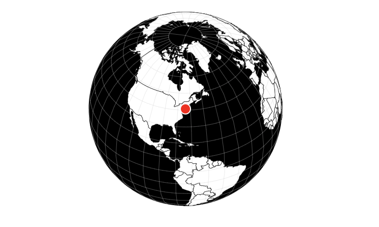

# Globe Component

## Overview

The **Globe Component** is a reusable Web Component built with [Lit](https://lit.dev/) that renders an interactive 3D globe using [D3.js](https://d3js.org/) and [TopoJSON](https://github.com/topojson/topojson). The globe highlights a specific point based on the provided longitude and latitude and allows users to interact with it by dragging to rotate.



## Features

- **Interactive Globe**: Drag to rotate the globe and explore different regions.
- **Highlighted Point**: A customizable point is highlighted on the globe based on provided coordinates.
- **Centered View**: The globe initially centers on the highlighted point.
- **Responsive Design**: The component adjusts to the size of its container.
- **Self-contained**: All data is bundled within the component—no external data files are needed.

## Technologies Used

- **Lit**: For building the Web Component.
- **D3.js**: For rendering the globe and handling geographic projections.
- **TopoJSON**: For working with the world map data.
- **Rollup**: For bundling the component and data into a single file.
- **JavaScript ES6 Modules**: For modular code organization.

## Table of Contents

- [Installation](#installation)
- [Usage](#usage)
- [Properties](#properties)
- [Development](#development)
- [Customization](#customization)
- [License](#license)

## Installation

### Prerequisites

- **Node.js** (v14 or higher recommended)
- **npm** (comes with Node.js)

### Steps

1. **Clone the Repository** (if applicable)

   ```bash
   git clone https://github.com/urnetwork/globe-component.git
   cd globe-component
   ```

2. **Install Dependencies**

   ```bash
   npm install
   ```

   This command installs all necessary packages, including development and production dependencies.

3. **Build the Component**

   Use the provided npm script to bundle the component into `bundle.js` using Rollup:

   ```bash
   npm run build
   ```

   This command generates a `bundle.js` file that includes the component code and the necessary data.

## Usage

### Include the Bundled Script

Include the `bundle.js` script in your HTML file:

```html
<script type="module" src="bundle.js"></script>
```

### Use the Component in HTML

Add the `<globe-component>` tag to your HTML, specifying the `longitude` and `latitude` as attributes:

```html
<globe-component
  longitude="-74.0060"
  latitude="40.7128"
  style="width: 600px; height: 600px;"
></globe-component>
```

### Example

```html
<!DOCTYPE html>
<html lang="en">
  <head>
    <meta charset="UTF-8" />
    <title>Globe Component Example</title>
  </head>
  <body>
    <!-- Include the bundled script -->
    <script type="module" src="bundle.js"></script>

    <!-- Use the globe component -->
    <globe-component
      longitude="-74.0060"
      latitude="40.7128"
      style="width: 600px; height: 600px;"
    ></globe-component>
  </body>
</html>
```

## Properties

- **`longitude`** (Number): The longitude of the point to highlight and center on the globe. Defaults to `-74.0060` (New York City).
- **`latitude`** (Number): The latitude of the point to highlight and center on the globe. Defaults to `40.7128` (New York City).

## Development

### Project Structure

```
globe-component/
├── bundle.js
├── globe-component.js
├── index.html
├── package.json
├── package-lock.json
├── rollup.config.js
└── README.md
```

### Scripts

The `package.json` includes the following scripts:

- **Development Server**

  ```bash
  npm run dev
  ```

  Starts a development server using Vite for live reloading during development.

- **Build**

  ```bash
  npm run build
  ```

  Bundles the component and data into `bundle.js` using Rollup.

- **Preview**

  ```bash
  npm run preview
  ```

  Serves the built project for previewing the production build.

### Dependencies

The project uses the following npm packages:

- **Production Dependencies**:

  - **`d3`**: For data visualization and rendering the globe.
  - **`lit`**: For building the Web Component.
  - **`topojson-client`**: For working with TopoJSON data.

- **Development Dependencies**:

  - **`@rollup/plugin-commonjs`**: For converting CommonJS modules to ES6.
  - **`@rollup/plugin-json`**: For importing JSON files.
  - **`@rollup/plugin-node-resolve`**: For locating and bundling third-party dependencies.
  - **`@rollup/plugin-terser`**: For minifying the output bundle.
  - **`vite`**: For running a development server.

### Build Configuration

The `rollup.config.js` file configures Rollup to bundle the component:

```javascript
import resolve from '@rollup/plugin-node-resolve'
import commonjs from '@rollup/plugin-commonjs'
import json from '@rollup/plugin-json'
import terser from '@rollup/plugin-terser'

export default {
  input: 'globe-component.js',
  output: {
    file: 'bundle.js',
    format: 'esm'
  },
  plugins: [resolve(), commonjs(), json(), terser()]
}
```

This configuration allows importing JSON files and minifies the final bundle.

### Development Steps

1. **Install Dependencies**

   ```bash
   npm install
   ```

2. **Start the Development Server**

   ```bash
   npm run dev
   ```

   Access the application at `http://localhost:5173`.

3. **Build the Project**

   ```bash
   npm run build
   ```

   The output `bundle.js` will be generated in the project root.

4. **Preview the Production Build**

   ```bash
   npm run preview
   ```

   Access the preview at `http://localhost:4173`.

## Customization

### Styling

The component comes with default styles defined using CSS within the component. You can customize the appearance by modifying the CSS in `globe-component.js`.

#### Default Styles

```css
:host {
  display: block;
}
svg {
  width: 100%;
  height: 100%;
}
.land {
  fill: #ffffff; /* White land */
  stroke: #000;
  stroke-width: 0.3px;
}
.globe {
  fill: #000000; /* Black ocean */
}
.graticule {
  fill: none;
  stroke: #cccccc60;
  stroke-width: 0.5px;
}
```

### Changing the Highlighted Point

You can change the highlighted point by updating the `longitude` and `latitude` attributes:

```html
<globe-component
  longitude="139.6917"
  latitude="35.6895"
  style="width: 600px; height: 600px;"
></globe-component>
```

This example centers the globe on Tokyo, Japan.

### Responsive Design

The globe adjusts to the size of its container. Set the `width` and `height` using CSS styles:

```html
<globe-component
  longitude="-74.0060"
  latitude="40.7128"
  style="width: 100%; height: 500px;"
></globe-component>
```

## License

This project is licensed under the **Mozilla Public License 2.0 (MPL 2.0)**. You are free to use, modify, and distribute this component as per the terms of the license.
